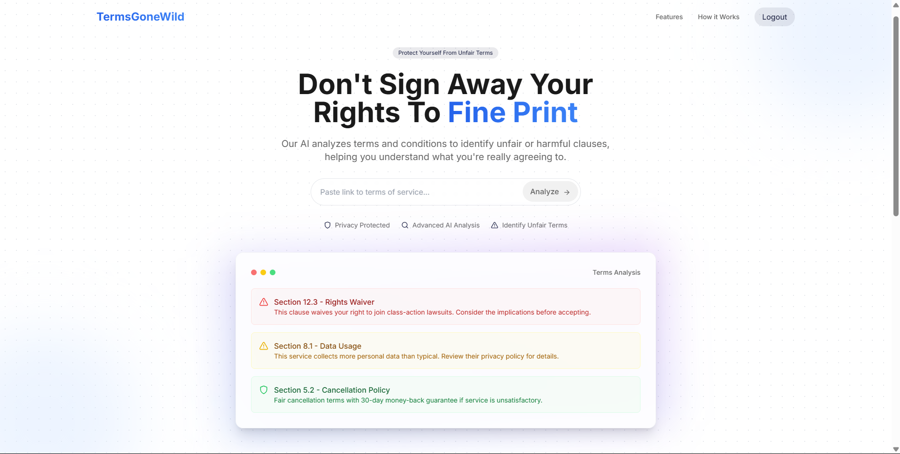
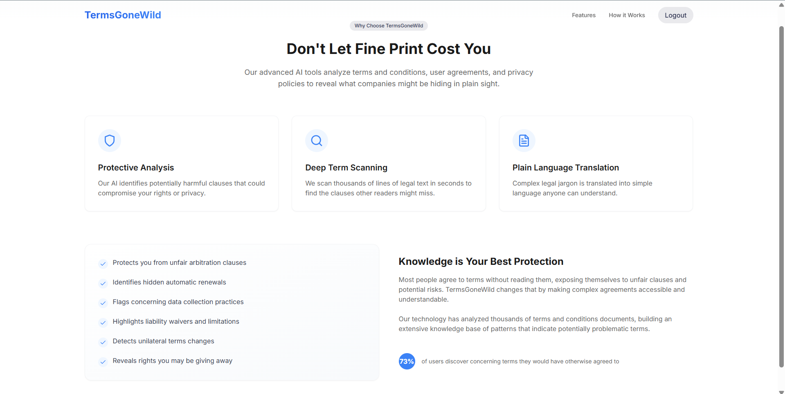
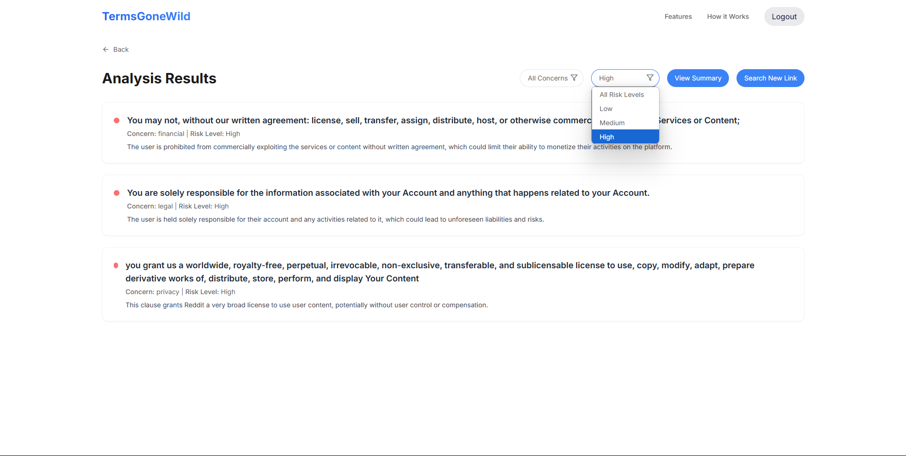

# TermsGoneWild

**TermsGoneWild** is a web application that uses AI to analyze terms and conditions, privacy policies, and user agreements. It helps users identify potentially harmful or unfair clauses in legal documents, making it easier to understand what they're agreeing to.

## Features

- **AI-Powered Analysis**: Scans legal documents for concerning clauses related to privacy, financial risks, legal liabilities, and unfair terms.
- **Plain Language Translation**: Translates complex legal jargon into simple, understandable language.
- **Risk Level Assessment**: Categorizes clauses by risk level (Low, Medium, High) to help users prioritize concerns.
- **Summary Reports**: Generates a summary of the analysis, highlighting key concerns and providing recommendations.
- **User Authentication**: Secure login and signup functionality using Firebase Authentication.

## Screenshots


*Caption: The application homepage showing the URL input field*


*Caption: Example of terms analysis with risk highlighting*


*Caption: Example of terms analysis with risk highlighting*

## Technologies Used

- **Frontend**: React.js, Tailwind CSS, Lucide Icons
- **Backend**: Flask (Python), Selenium (for web scraping), Groq API (for AI analysis)
- **Authentication**: Firebase Authentication
- **Deployment**: (Optional) Docker, Heroku, or any cloud platform

## Getting Started

### Prerequisites

- Python 3.8 or higher
- Node.js and npm (for frontend)
- Firebase project (for authentication)
- Groq API key (for AI analysis)

### Installation

1. **Clone the repository**:
   ```bash
   git clone https://github.com/your-username/TermsGoneWild.git
   cd TermsGoneWild

2. **Set up the backend**:
   
   Navigate to the backend directory:
   ```bash
   cd backend
   ```

   Install Python dependencies:
   ```bash
   pip install -r requirements.txt
   ```
   
   Create a .env file in the backend directory and add your Groq API key:
   ```env
   GROQ_API_KEY=your_groq_api_key_here
   ```
   
   Run the Flask server:
   ```bash
   python app.py
   ```
   
4. **Set up the frontend:**
   
   Navigate to the frontend directory:
   ```bash
   cd ../TGW/project
   ```
   
   Install Node.js dependencies:
   ```bash
   npm install
   ```
   
   Create a firebase.js file in the frontend directory and add your Firebase configuration:
   ```javascript
      // firebase.js
      import { initializeApp } from 'firebase/app';
      import { getAuth } from 'firebase/auth';

      const firebaseConfig = {
        apiKey: "your-api-key",
        authDomain: "your-project-id.firebaseapp.com",
        projectId: "your-project-id",
        storageBucket: "your-project-id.appspot.com",
        messagingSenderId: "your-messaging-sender-id",
        appId: "your-app-id",
        measurementId: "your-measurement-id"
      };
      const app = initializeApp(firebaseConfig);
      const auth = getAuth(app);
      export { auth };
   ```
   
   Start the React development server:
   
   ```bash
   npm run dev
   ```
   
6. **Access the application:**
   Open your browser and navigate to http://localhost:3000.
   
## Usage

- Paste a URL: On the homepage, paste the URL of the terms and conditions or privacy policy you want to analyze.
- View Analysis: The AI will analyze the document and display concerning clauses with their risk levels and explanations.
- Filter Results: Use the filters to view clauses by concern (e.g., privacy, financial) or risk level.-
- Generate Summary**: Click "View Summary" to get a detailed summary of the analysis.

## Acknowledgments

- **Groq API**: For providing the AI-powered legal analysis.
- **Firebase**: For authentication and user management.
- **Selenium**: For robust web scraping capabilities.
- **Tailwind CSS**: For a sleek and responsive UI.
